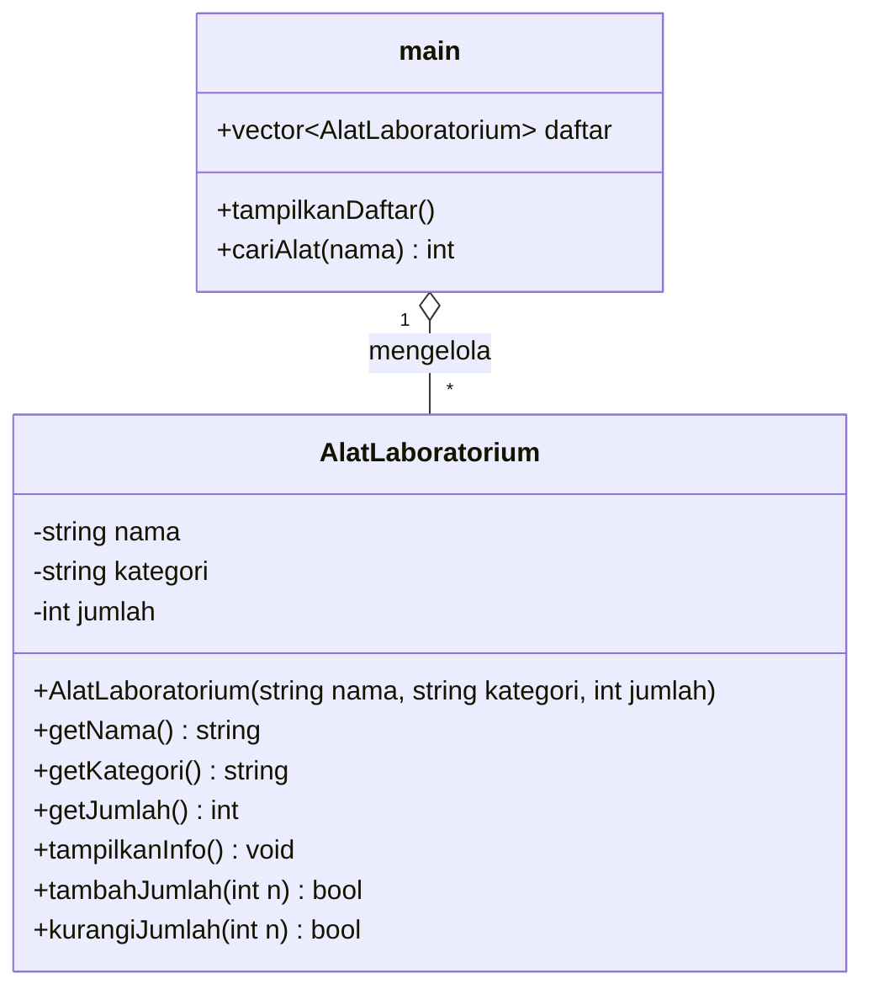

# Class Diagram

```mermaid
classDiagram
    class AlatLaboratorium {
        -string nama
        -string kategori
        -int jumlah
        +AlatLaboratorium(string nama, string kategori, int jumlah)
        +getNama() string
        +getKategori() string
        +getJumlah() int
        +tampilkanInfo() void
        +tambahJumlah(int n) bool
        +kurangiJumlah(int n) bool
    }
    class main {
        +vector~AlatLaboratorium~ daftar
        +tampilkanDaftar()
        +cariAlat(nama) int
    }
    main "1" o-- "*" AlatLaboratorium : mengelola
```

Alur program: input (menu) -> pengolahan (tambah/kurangi/cari pada `vector`) -> output (daftar/info alat).

Keterangan: `-` = private, `+` = public.
